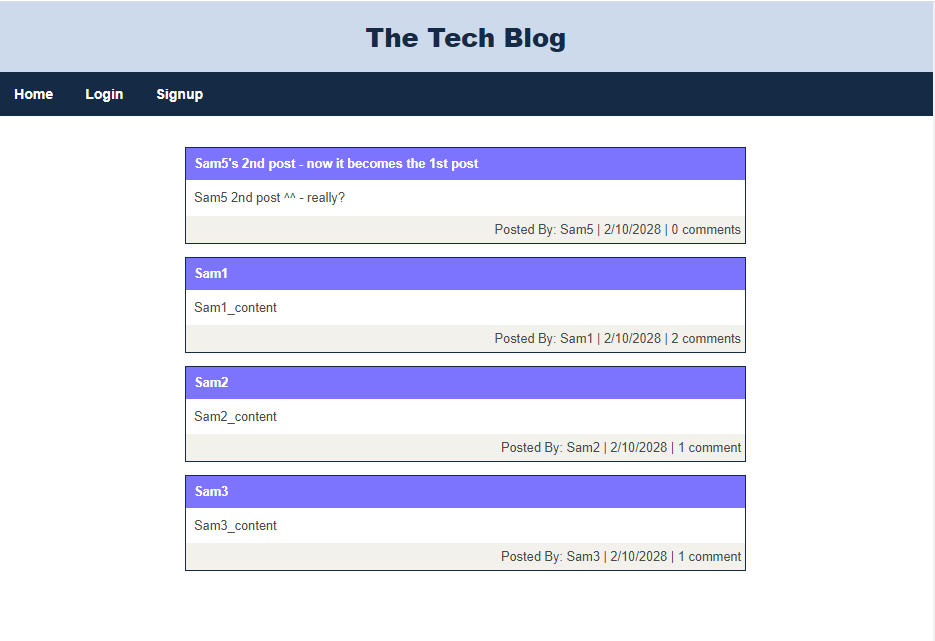

# Model-View-Controller (MVC): Tech Blog
  

## 1. Table of Contents:
This readme file includes the following contents:
+ [Description](#2-description)
+ [Installation](#3-installation)
+ [Usage](#4-usage)
+ [License](#5-license)
+ [Application results](#6-application-results)
+ [Questions](#7-questions)

## 2. Description: 
Writing about tech can be just as important as making it. Developers spend plenty of time creating new applications and debugging existing codebases, but most developers also spend at least some of their time reading and writing about technical concepts, recent advancements, and new technologies. This app is a CMS-style blog site similar to a Wordpress site, where developers can publish their blog posts and comment on other developers' posts as well. So, this app follows the MVC paradigm in its architectural structure, using `Handlebars.js` as the templating language, `Sequelize` as the Object-Relational Mapping (ORM), and the `express-session` npm package for authentication.

## 3. Installation:
Please make sure to have following programs installed on your computer to use this app:
+ VS Code
+ GitBash
+ Node.js
+ MySQL

To use this program, `git clone` the repo down to your local. Then, run `npm install` in order to install the `npm` package dependencies as specified in the `./package.json` - `Express.js`, `mysql2`, `sequelize`, and `dotenv` will be installed. Now, you are ready to go!

## 4. Usage:
To use this application, follow the instruction below: 
+ First, run `npm install` on your terminal, then it will install the required `npm` packages.
+ Second, let's create the database - `tech_blog_db`:
  + `mysql -u root -p`: login to `MySQL` then type the following commends:
  + `source ./db/schema.sql;`: this will create `tech_blog_db`
  + `show databases;`: Now, you will see `tech_blog_db` in the `Database` list
  + `use tech_blog_db;`: it is empty now.
  + `show tables`: there is no tables yet.
  + `exit`: exit the mysql terminal
+ Third, let's include tables in the database we just created, `tech_blog_db`:
  + `node ./seeds/index.js` or `npm run seed`: these will insert the following tables in the `tech_blog_db`:
    + `comment`
    + `post`
    + `user`
+ Now, let's run the program:
  + Set an Environmental Variable in `./.env` file:
    + `touch .env`: this will create `./.env` file
    + Now, add the following three lines in `./.env`
      + DB_NAME="tech_blog_db"
      + DB_USER="root"
      + DB_PASSWORD="your_mysql_password"
  + Then, run the program with one of the following approaches:
    + `node server.js` or `npm run start`: these will start `node` program in normal way. 
    + `nodemon server.js` or `npm run nodemon`: these will start `node` program with `nodemon`, which monitors the project directory and automatically restarts your node application when it detects any changes.
  + Now, check the results in your localhost: 
    + localhost:3003/

This project has the following directory structure:
+ ./assets: project workthrough video & supporting materials
+ ./config: this will allow you to connect to the `mysql` database
+ ./controllers: these javascript files will create (or define) each route's behavior 
+ ./db: this will create a database, `tech_blog_db`, with empty tables.
+ ./models: these javascript files will create `Sequelize` models for each table in `tech_blog_db`
+ ./Public: css style files and additional javascript files
+ ./seeds: these javascript files will create (seed) tables in `tech_blog_db`
+ ./utils: helper files to use handlebars
+ ./views: Express-Handlebars related files
+ ./.gitignore: specifies intentionally untracked files that Git should ginore
+ ./LICENSE: MIT License 
+ ./package.json: specifics of npm's package.json handling
+ ./server.js: main node.js program Javascript file
+ ./README.md: readme file

## 5. License:
### The MIT License
  

## 6. Application results:
[GitHub:] https://github.com/jungwoo33/week14_MVC_Tech_Blog 
View walk through video here - [Screencastify](https://drive.google.com/file/d/11xE_7HT_q0aWY7j2gaHH3Z_Hk2jR9qg5/view) 
or the original video file is in `./assets/mvc_tech_blog.avi` 
The final application is deployed in Heroku: https://git.heroku.com/still-stream-47597.git

## 7. Questions?:
If you have any questions, feel free to contact me via information below: 
[GitHub:] https://github.com/jungwoo33 
[Email:] jungwoo33@gmail.com

- - -
© 2023 Jungwoo Lee. Confidential and Proprietary. All Rights Reserved.